# CircleSample on Android Projects
#### Author Romell Domínguez
## Basic Module

Cuando tenga listo su apllicación Android/Gradle, registrar su aplicación en circleci.com 

Cuando enlacen su projecto(en este caso Bitbucket también funciona para Github), nos permitirá enlazar nuestro projecto con una configuración *.yml este debe ser colocado en una carpeta llamada '.circleci/':

> ./circleci/config.yml
```yml
version: 2
jobs:
  build:
    working_directory: ~/code
    docker:
      - image: circleci/android:api-25-alpha
    environment:
      JVM_OPTS: -Xmx3200m
    steps:
      - checkout
      - restore_cache:
          key: jars-{{ checksum "build.gradle" }}-{{ checksum  "app/build.gradle" }}
      - run:
         name: Chmod permissions #if permission for Gradlew Dependencies fail, use this.
         command: sudo chmod +x ./gradlew
      - run:
          name: Download Dependencies
          command: ./gradlew androidDependencies
      - save_cache:
          paths:
            - ~/.gradle
          key: jars-{{ checksum "build.gradle" }}-{{ checksum  "app/build.gradle" }}
      - run:
          name: Run Tests
          command: ./gradlew lint test
      - store_artifacts:
          path: app/build/reports
          destination: reports
      - store_test_results:
          path: app/build/test-results

#
```

<p align="center">
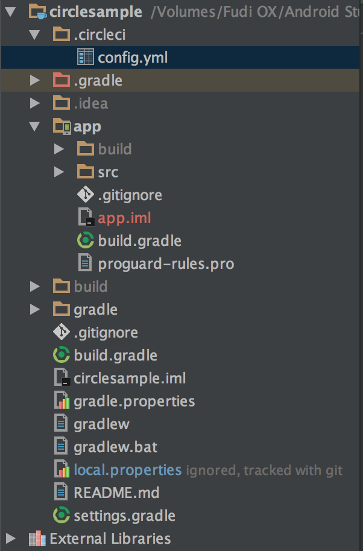</p>

En la configuración del bitbucket deben de estar asegurado que los permisos de escritura esten habilitados para commits inmediatos en el branch original

<p align="center">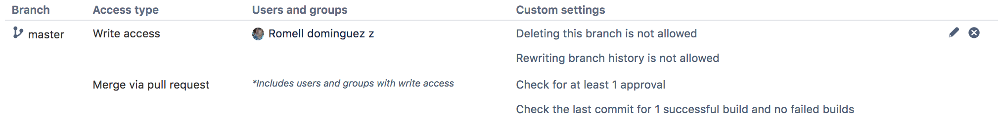</p>

Para hacer dinamico la prueba generamos un caso de prueba unitario erroneo:

<p align="center"></p>

<p align="center"></p>

Cuando realizamos el push el git remote, podemos visualizar que circleci comienza a ejecutar todas las pruebas 

<p align="center">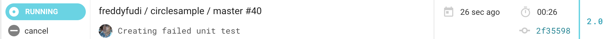</p>

Una vez finalizado nos indicará la falla encontrada

<p align="center">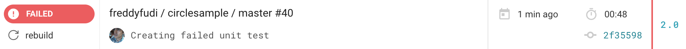</p>

Ahora supongamos que ya resolvimos la incidencia, y las pruebas unitarias han sido corraboradas, realizamos push al git remote, en Circleci vemos que automáticamente las pruebas comezarón a ejecutarse

<p align="center">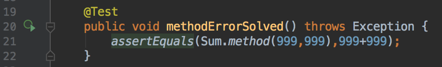</p>

<p align="center">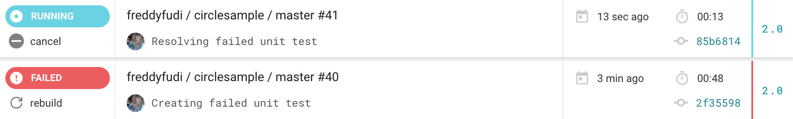</p>

Una vez finalizado podemos apreciar en el dashboard de Circleci nos indica que ha culminado con éxito

<p align="center">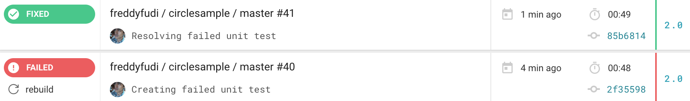</p>

Resumiendo el dashboard de circle ci muestra lo siguiente, donde:

* NOT RUN: Indica la prueba no ha sido ejecutada.
* SUCCESS: La prueba ha sido ejecutada satisfactoriamente
* FAILED: La prueba ha presentado incidencias
* FIXED: SI encuentra todas las pruebas fallidas anteriormente ejecutadas pasan correctamente

<p align="center">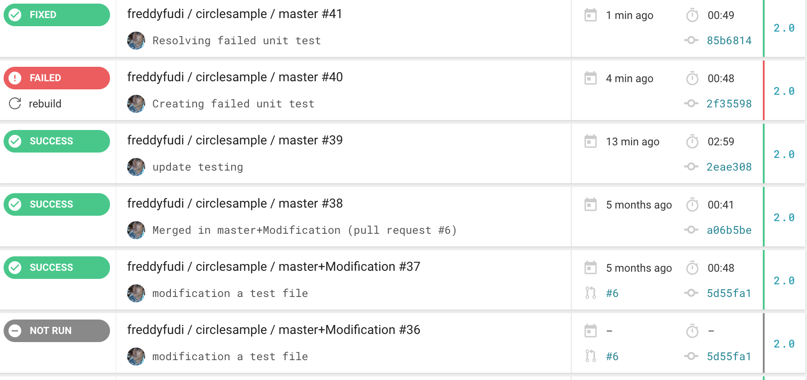</p>

## Intermediate Module

Una vez visto el potencial de la herramienta vamos a ver lo realmente útil que podemos hacer con Circleci, supongamos que en nuestro team Development queremos asegurar el branch maestro de nuestro repositorio siempre tenga una versión estable, donde todo lo desarrollado ha sido probado correctamente.

En la configuración de permisos de branch ahora quitaremos los permisos a todos los usuarios vías directas, y habilitamos únicamente los permisos vía pull request

<p align="center"></p>

Generamos nuevamente un caso  de prueba 'serviceModule', en mi caso estoy probando una interfaz utilizando la libraría mokito 

<p align="center"></p>

Hacemos el commit respectivo

<p align="center"></p>

Pero al intentar enviar nuestros cambios al remote origin, el repositorio nos rechazará por no tender permisos

**Y AHORA QUÉ HAGO?**

<p align="center">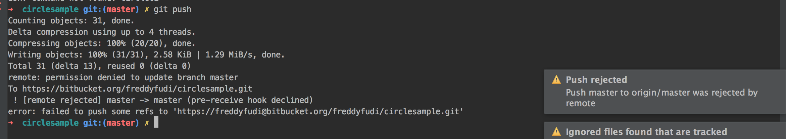</p>

**Simple generamos una rama a partir de la principal**
En la ventana de 'Push Commits' AndroidStudio, tendremos que pasar todos nuestros cambios a una rama auxiliar

<p align="center">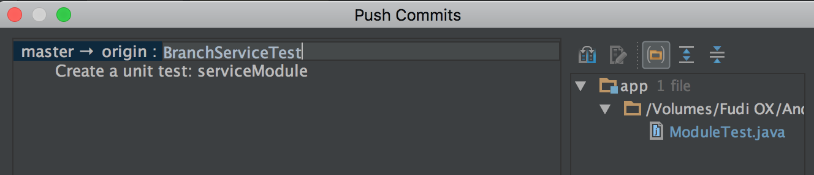</p>

<p align="center">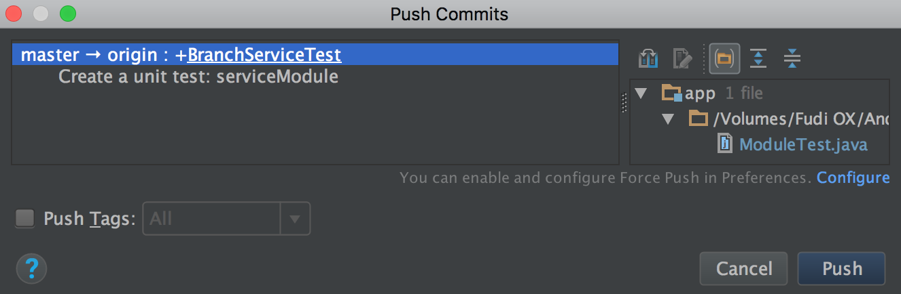</p>

Al realizar push, nos dejará libremente crearla debido a que únicamente deshabilitamos los cambios directos en el branch master.

<p align="center"></p>

En el dasdhboard de nuestro proyecto en Circleci, veremos que hay un registro de pruebas con la etiqueta **NOT RUN**, está se agrega al detectar nuevos cambios en el repositorio

<p align="center">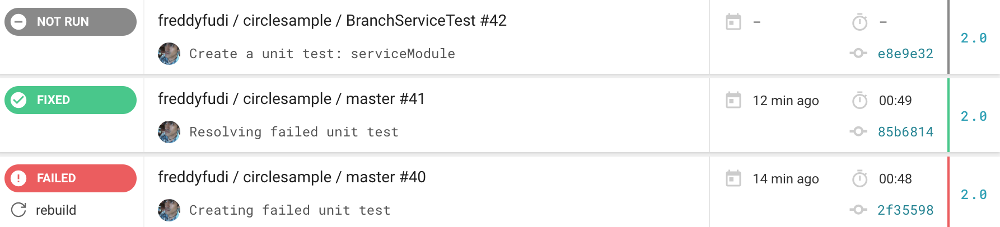</p>

Por otro lado en nuestro árbol de cambios/commits visualizaremos la nueva rama 'BranchServiceTest', creada desde nuestro AndroidStudio

<p align="center">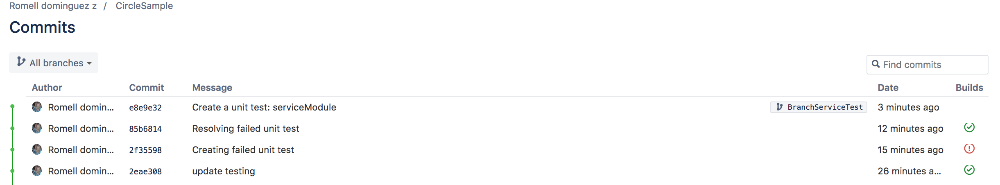</p>

La persona encargada del cambio, que ha creado el nuevo branch, tiene que solicitar el merge al remote origin (crear nuevo pull request) 

<p align="center">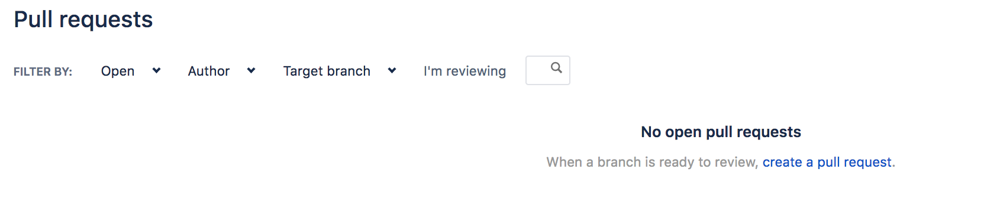</p>

En el detalle debe indicar los cambios que ha relizado a alto nivel, confirmando que ha añadido sus respectivos casos de pruebas

<p align="center">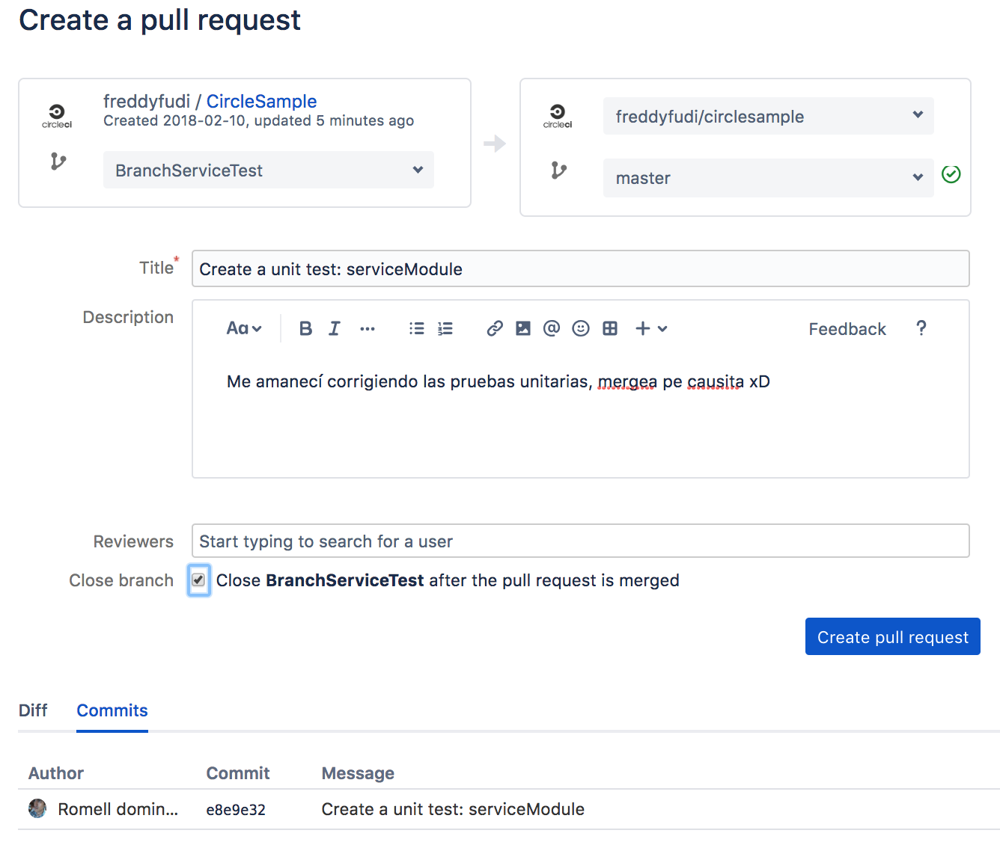</p>

En la pantalla de pull requests se habrá añadido la solicitud para el respectivo merge

<p align="center"></p>

Al entrar en el detalle podemos ver los cambios con sus comentarios hechos y el mensaje del desarrollador. **Debemos percatarnos de algo muy especial, tenemos un toggle button en la parte superior derecha (Approve)**. Al hacer click procederá la ejecución de los casos de pruebas en Circleci

<p align="center">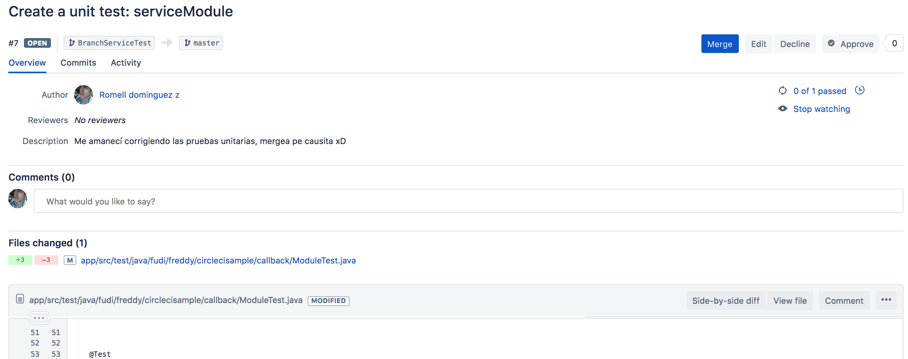</p>

En el dashboard veremos como las pruebas se han ejecutado, una vez terminado visualizamos con éxito la ejecución de pruebas

<p align="center">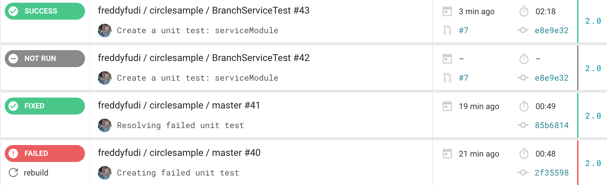</p>

En la pantalla donde estamos del bitbucket visualizamos que hay un contador de pruebas ejecutadas, en nuestro caso como no ha detectado que los flujos de otros casos de pruebas han sido modificados, únicamente ejecutará nuestro caso de prueba 'serviceModule' de la clase ModuleTest 

<p align="center">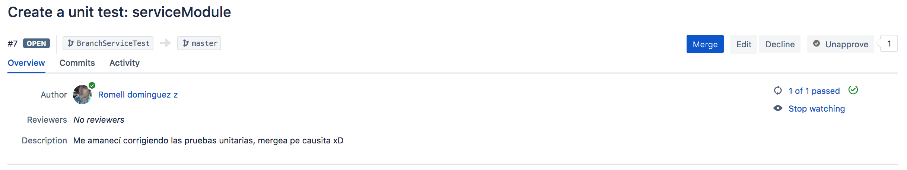</p>

En caso el administrador este conforme con  la implementación de los casos sean conforme, puede proceder al merge. **Asegurando una tasa de fiabilidad del código en todo momento** 

<p align="center">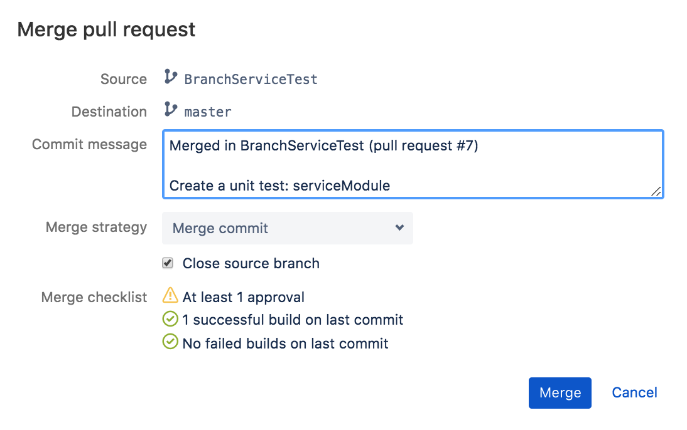</p>

En el apartado de los commits visualizamos que ya no existe la rama auxiliar, manteniendo nuestro cambios en el branch 'master' 

<p align="center">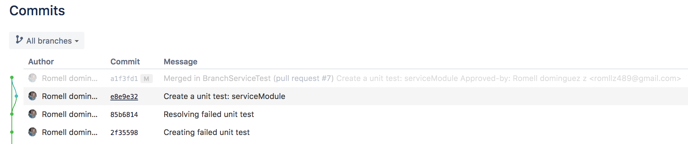</p>

Como podemos apreciar la herramienta Circleci nos permite una gran utilidad, para la gestión y control del versionamiento de los casos de pruebas automatizados, permitiendo diversificar las tareas entre los colaboradores del proyecto donde requieran pruebas

## Advance module

En el dashboard de Cicleci si entramos en uno de los resultados de las ejecuciones podemos ver:

<p align="center">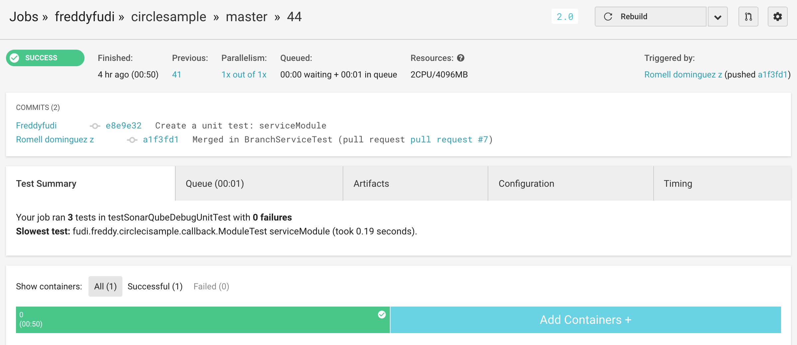</p>

Podemos ver el registro a detalle de la prueba, step by step de todos los comandos que hemos dichos que realice:

<p align="center">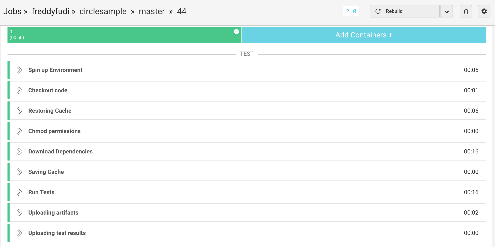</p>

En el apartado de 'Chmod permissions' es muy usual que los principiantes en esta herramienta tengan problemas debido a dependiendo de la maquina esta necesitará permisos SUDO

```yml
jobs: ...
  build: ...
    steps: ...
      - run: ...
         command: sudo chmod +x ./gradlew
...
```

Como se puede apreciar la herramienta Circleci soporta flavors de gradle, en este proyecto estoy usando el flavor 'SonarQube' para luego conectarlo a una base de hechos de pruebas en caso lo requiera por parte de la organización  :

<p align="center">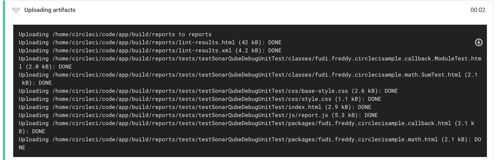</p>

Todos los derechos reservados de uso a la herramienta :

<p align="center"><a href="https://circleci.com/"></p>

Release July 14, 2018
